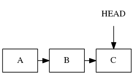
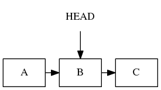
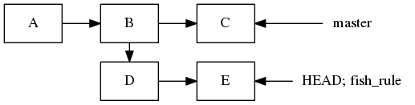
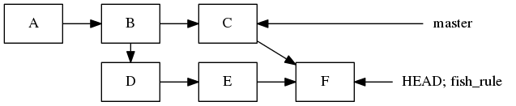
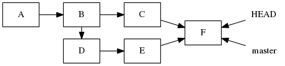
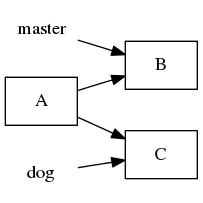
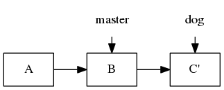
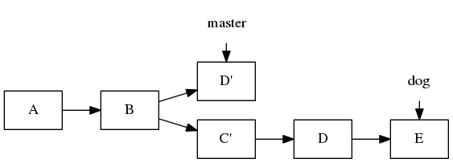
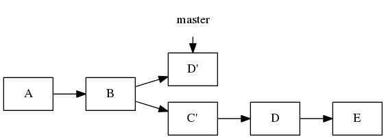
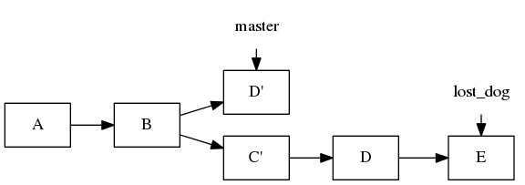

---
author:
- Andrew Ballinger
subtitle: '(Working Title)'
title: ' Git and You \<3 '
...


### What is a git and how do I get one?

Git is a version control system developed for working on the Linux
Kernel.

``` {frame="single"}
 git init
 ls -lA
 ls .git
 git status
```


### Tracking files

Lets add some files.

``` {frame="single"}
 touch some_random_file
 echo "puts 'Hello World'" > hello.rb
 ruby hello.rb
 git add hello.rb
 git status
```

``` {frame="single"}
echo "some_random_file" >> .gitignore
git status
```


### Tracking changes

Lets save this stuff.

``` {frame="single"}
  git commit -m "This is the first commit"
  git status
  git log
```


### Tracking changes

Lets do some stuff.

``` {frame="single"}
  echo "puts 'Hello Fish'" > hello.rb
  ruby hello.rb
  git commit -m 'Hello Fish?'
  echo 'puts "Hello " + [0x1F431].pack("U*")' > hello.rb
  git commit -am 'Hello?'
  ruby hello.rb
```




### What is HEAD?

Spoiler: It’s the current commit

``` {frame="single"}
  git branch 'sweet_cat_branch'
  git checkout HEAD~1
  ruby hello.rb
```




### Branching

``` {frame="single"}
  git branch "fish_rule"
  git checkout "fish_rule"
  echo 'puts "Fish Rule"' >> hello.rb
  ruby hello.rb
  git commit -am "Fish are way better then cats"
  echo '["Fish live in the ocean."]' >> fish_facts.json
  git add fish_facts.json
  git commit -am "Some fish facts"
  git log
```




### Merging

Merging allows you to combine changes

``` {frame="single"}
  git diff master
  git merge master
```


### Merging

Merging allows you to combine changes

``` {frame="single"}
  git diff master
  git merge master
```

``` {frame="single"}
  git status
  cat hello.rb
  git checkout --ours hello.rb 
  git status
  git commit -am "Fish are better"
  git status
```




### Fast Forwarding

Fish are super awesome, they’re going into production.

``` {frame="single"}
 git checkout master
 git merge fish_rule
 git status
 git log
```




### Push and Pull

Push moves your current branch onto a remote server

``` {frame="single"}
  git push 
```

Pull gets (merges!) your current branch from the remote server

``` {frame="single"}
  git pull 
```

### That’s it (basically)


### git praise (It’s really called git blame)

Credit where credit is due.

``` {frame="single"}
  git config --global alias.praise blame
  git praise fish_facts.json
```

-   <span>Who can I ask about this?</span>

-   <span>How old is this code?</span>

-   <span>What was the most recent change?</span>


### git bisect

Find out the exact commit that broke something.

``` {frame="single"}
  git bisect start
  git bisect bad
  git checkout <known good branch>
  git bisect good
```

When it works it’s magical, try it out.


### git diff revisited

Diff is your friend; it is way more powerful then you might know.

``` {frame="single"}
  git checkout -b "cats_strike_again"
  mv fish_facts.json cat_facts.json
  sed 's/Fish/Cats/g' cat_facts.json
  git checkout sweet_cat_branch -- hello.rb
  ruby hello.rb
  git commit -am "Cat 3.0 is way faster"
  git commit --amend -m "Cat 3.0! fish sucks!"
```

``` {frame="single"}
  git diff master@{10.minutes.ago} cats_strike_again
  git diff master~4 -- hello.rb
  git diff HEAD cats_strike_again
```


### git log revisited

Git log also has super powers.

``` {frame="single"}
  git log --author="andrewb" --pretty=full   
  git log -p -S "Fish"
  git log --after={15.minutes.ago}
```

-   <span>Who’s deleting the most code?</span>

-   <span>What was that code I wrote last tuesday?</span>

-   <span>Who added this feature and who uses it?</span>


### git rebase

``` {frame="single"}
  git checkout master
  git branch dog
  touch foo
  git add foo
  git commit -m "Added foo"
  git checkout dog
  ls
  touch woof
  git add woof
  git commit -m "Added woof"
```




### git rebase

Subtly different from a merge! Can be used to produce a git history with
no merge conflict commits.

``` {frame="single"}
  git rebase master
```




### git cherrypick

``` {frame="single"}
  touch good_file
  git commit -am "good commit"
  touch bad_file
  git commit -am "bad commit"
  git checkout master
  git cherry-pick <find the good one>
  ls
```




### Losing your work with delete

If you never do the likes of this, you’re not trying hard enough.

``` {frame="single"}
  git branch -D dog
  git branch
  git status
  git checkout master
  git status
```




### Reflog to the rescue!

``` {frame="single"}
  git reflog
  git checkout <lost commit>
  git branch lost_dog
```




### Losing your work with reset

``` {frame="single"}
  touch the_file
  git add the_file
  git reset --hard
  ls
```

It’s gone. Really gone.

``` {frame="single"}
  git checkout -- .
```


### So what?

-   <span>Commit frequently and never lose your work again</span>

-   <span>Use descriptive commit messages and never forget what you were
    doing</span>

-   <span>Merge master often, work on fast moving projects</span>

-   <span>Work from any machine with an internet connection</span>

-   <span>Navigate code smarter and find bugs faster</span>

-   <span>Code metadata, exactly what, when, why, and who</span>

-   <span>Stop time, go work on something else, and pick it right back
    up again</span>


### Other nifty git stuff

You can google this stuff, or I can talk about it now:

-   <span>hooks</span>

-   <span>git stash</span>

-   <span>git file structure</span>

-   <span>tig</span>
